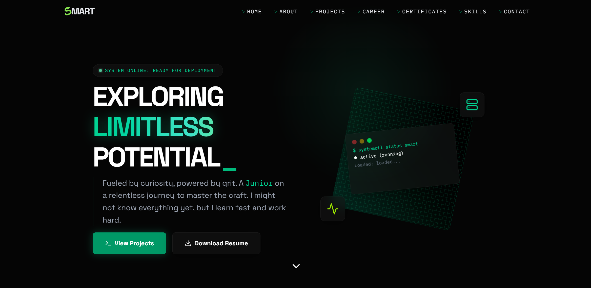

<div align="center">

#👨‍💻 Portfolio



[](https://nextjs.org/)
[](https://www.typescriptlang.org/)
[](https://tailwindcss.com/)
[](https://supabase.com/)
[](https://opensource.org/licenses/MIT)

<br />

</div>

## 🚀 Overview

My Portfolio is a modern, production-ready personal website designed to showcase professional work, projects, certifications, and skills with a premium look and feel. Built with performance and SEO in mind, it leverages Server-Side Rendering (SSR) and a responsive design to deliver an exceptional user experience across all devices.

> "A modern, production-ready portfolio website showcasing professional work, projects, certifications, and skills. Built with Next.js and TypeScript, connected to Supabase for dynamic content."

---

## ✨ Key Features

- **🎭 Dynamic Hero**: An engaging landing section featuring an animated typewriter effect that rotates through professional roles.
- **📂 Projects Showcase**: A powerful grid/list view for projects with advanced filtering/search capabilities and detailed modal views.
- **📜 Certificates Gallery**: A beautiful fullscreen viewer for certifications with smooth transition animations.
- **⏳ Career Timeline**: An interactive visualization of work history and professional milestones.
- **🧠 Skills Matrix**: A clear, categorized display of technical skills and proficiency levels.
- **📧 Contact Form**: A secure, rate-limited contact form with real-time validation to easier communication.
- **📱 Smooth Navigation**: Fully responsive navbar and mobile menu ensuring seamless navigation on devices from mobile to 4K.

---

## 🛠️ Tech Stack

- **Framework**: [Next.js 16 (App Router)](https://nextjs.org/)
- **Language**: [TypeScript 5.6](https://www.typescriptlang.org/)
- **Library**: [React 19](https://react.dev/)
- **Styling**: [Tailwind CSS 4.1](https://tailwindcss.com/)
- **Animations**: [Framer Motion](https://www.framer.com/motion/)
- **Icons**: [Lucide React](https://lucide.dev/)
- **Backend / Database**: [Supabase](https://supabase.com/)

---

## 🚀 Getting Started

Follow these instructions to get a copy of the project up and running on your local machine for development and testing purposes.

### Prerequisites

Ensure you have the following installed:

- [Node.js](https://nodejs.org/) (Version 18 or higher recommended)
- [npm](https://www.npmjs.com/)

### Installation

1.  **Clone the repository:**

    ```bash
    git clone https://github.com/yourusername/01-portfolio.git
    cd 01-portfolio
    ```

2.  **Install dependencies:**

    ```bash
    npm install
    ```

3.  **Set up environment variables:**
    Create a `.env.local` file in the root directory and add your Supabase credentials:

    ```env
    NEXT_PUBLIC_SUPABASE_URL=your_supabase_url
    NEXT_PUBLIC_SUPABASE_ANON_KEY=your_supabase_anon_key
    ```

4.  **Run the development server:**

    ```bash
    npm run dev
    ```

    Open [http://localhost:3000](http://localhost:3000) with your browser to see the result.

---

## 📂 Project Structure

```bash
src/
├── app/              # Next.js App Router pages and layouts
├── components/       # React components
│   ├── sections/     # Main page sections (Hero, About, Projects, etc.)
│   ├── features/     # Feature-specific components
│   └── ui/           # Reusable UI components (Buttons, Cards, Inputs)
├── lib/              # Utility functions and Supabase client configuration
└── types/            # TypeScript type definitions and interfaces
```

**Key Directories:**

- `app/`: Contains the main application routes.
- `components/sections/`: Components that make up the main landing page.
- `lib/`: Helper functions and external service configurations.

---

## 📸 Screenshots

|                     **Dashboard / Home**                      |                          **Projects View**                          |
| :-----------------------------------------------------------: | :-----------------------------------------------------------------: |
|  |  |

> _Replace the placeholder images above with actual screenshots of your application to give visitors a preview._

---

## 👤 Author

**Smart Somkid Sodsai**

- Website: [Smart Somkid Sodsai](https://smart-th.com)
- GitHub: [@Smart Somkid Sodsai](https://github.com/somkid-s5)

<div align="center">
  <sub>Built with ❤️ by Smart Somkid Sodsai</sub>
</div>
